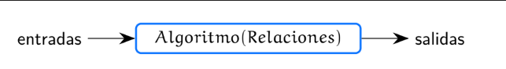

# • Sesión I de teoría.

Tags: 1. Introducción (Parte I)
Property: 1.   ¿Qué son las ciencias de la computación?
    ◦ 1.1. Computación
    ◦ 1.2. Algoritmos y funciones
    ◦ 1.3. Complejidad
    ◦ 1.4. Modelos teóricos
    ◦ 1.5. Disciplinas semejantes
 
2.   Lenguajes de programación
    ◦ 2.1. Paradigmas
    ◦ 2.2. Declarativo, imperativo y orientación a objetos
    ◦ 2.3. Los 4 paradigmas y algunos lenguajes
Status: Done

> En esta lección introductoria se verá qué son las Ciencias de la Computación, conceptos y algunas técnicas distintivas del campo y algunos antecedentes históricos relevantes.
> 

# 1. **¿Qué son las ciencias de la computación?**

Presentación PDF: **[Ciencias de la computación](https://drive.google.com/file/d/1fDJpV1nIiH-BtweVsWtA1zMLQ5qGvpg3/view?usp=drive_link)**

[1 Computación Vol](https://youtu.be/2j3kxsQrZU4)

## **1.1. Computación**

- Lo que queremos es resolver problemas y automatizar esas soluciones. Por ello además de la computadora, el cuaderno es una herramienta esencial para nuestro trabajo. (diseñar)

<aside>
💡 (**Definición**) Una **computadora** es una máquina electrónica capaz de almacenar información y tratarla automáticamente mediante operaciones matemáticas y lógicas controladas por programas informáticos.

</aside>

- El objetivo principal de las computadoras es que **resuelvan problemas, de forma automatiza.**

<aside>
💡 (**Definición**) Un **programa** es una secuencia de instrucciones que le indica a la computadora cómo resolver un problema.

</aside>

**Definición (Computación):**

“La disciplina de la computación es el estudio **sistemático** *(se estudia el problema de manera formal, sistemática. Para encontrar soluciones eficientes)* de procesos algorítmicos que **describen** *(para llegar a soluciones primero necesito información del problema, describirlo)* y **transforman información** *(que es la solución del problema)*: *(para hacer lo anterior se necesita:)* su **teoría**, **análisis**, **diseño** (*este es un campo muy creativo)*, **eficiencia** *(queremos encontrar soluciones y además que sean las mejores posibles, incluso evaluamos la calidad de nuestras soluciones)*, **implementación** *(nos interesa encontrar la solución valiéndonos de las matemáticas muchas veces, pero además nos interesa describirlas con algoritmos de manera que las computadoras puedan resolverlas, queremos aterrizar esas soluciones a problemas concretos)* y **aplicación**.

*La pregunta fundamental subyacente en toda la computación es ¿qué puede ser (eficientemente) automatizado?” (que familias de problemas pueden ser modelados de forma algorítmica para ser aplicados a escenarios concretos).*

*Peter Denning, 2005*

- **La computación tiene dos raíces fundamentales:**

La búsqueda de una sistematización del pensamiento. Es decir, la búsqueda de algoritmos para resolver problemas, algunas veces generales y otras concretos.

La búsqueda para desarrollar implementos o medios que permitan realizar cálculos de manera precisa y eficiente.

## **1.2. Algoritmos y funciones**

[2   Algoritmos y funciones Vol](https://youtu.be/MzVSHXMY3dg)

- **Definición (Algoritmo):**

Un algoritmo es una secuencia de pasos que transforma un valor o conjunto de valores, conocidos como entradas, en un valor o conjunto de valores, conocidos como salidas, de tal modo que éstas satisfagan un conjunto de relaciones *(características o condiciones que debe cumplir el algoritmo al buscar la solución para considerarse valida)* previamente especificadas. *(es una definición formal del análisis y diseño de las soluciones que vimos previamente).*



Las fórmulas matemáticas son, por ejemplo, algoritmos; son generales, lo que varía son los valores (entradas y salidas). (como una receta determinista).

- **Definición (Función)** *(retomado de las matemáticas)*

Una función recibe un conjunto de argumentos y produce un único resultado que depende de esos argumentos.


En principio son lo mismo, es como un algoritmos en su sentido matemático, la diferencia es que cuando hablamos de una función se habla de un ente más general y abstracto, incluso implícito lo que está dentro de la función y como es que devuelve el resultado, mientras que en un algoritmo si se tiene explícitamente una secuencia de pasos que nos dice como transformar las entradas en las salidas, lo que está en la cajita. Entonces un algoritmo es la **especificación** de una función.

La función nos ayudará para el estudio teórico de el problema general (si existe, si podemos guiarnos en algo para encontrar el algoritmo, etc.), incluso antes de tratar de encontrar el algoritmo concreto.

*Chat*:

La diferencia principal entre una función y un algoritmo en ciencias de la computación es que una función es una parte de un programa que realiza una tarea específica, mientras que un algoritmo es un conjunto de pasos lógicos y bien definidos que se utilizan para resolver un problema.

Una función es una porción de código que se puede reutilizar en diferentes partes de un programa. Una función recibe una o varias entradas, realiza una serie de operaciones sobre estas entradas y devuelve una salida. Por ejemplo, una función que realice una operación matemática, como una suma, recibiría dos números como entrada y devolvería el resultado de la suma como salida.

Un algoritmo, por otro lado, es un conjunto de pasos lógicos y bien definidos que se utilizan para resolver un problema de forma eficiente. Un algoritmo puede ser implementado en un programa utilizando un lenguaje de programación, pero también puede ser expresado en pseudocódigo o en forma natural. Por ejemplo, un algoritmo para ordenar una lista de números podría ser implementado en un programa como una función que utiliza un algoritmo de ordenamiento, pero también podría ser expresado en pseudocódigo o en forma natural.

Claro, aquí tienes un **ejemplo** que ilustra la diferencia entre una función y un algoritmo en ciencias de la computación:

Imagina que quieres escribir un programa que calcule el área de un círculo dado su radio. Para resolver este problema, puedes utilizar una función que reciba el radio del círculo como entrada y devuelva el área del círculo como salida. La función podría tener la siguiente forma:

```java
**def calcular_area_circulo(radio):
area = 3.1416 * (radio * radio)
return area**
```

En este ejemplo, la función calcular_area_circulo es una porción de código que recibe el radio del círculo como entrada y devuelve el área del círculo como salida. La función realiza una operación matemática simple (el cálculo del área del círculo) y puede ser reutilizada en diferentes partes del programa.

Por otro lado, para calcular el área de un círculo también se puede utilizar un algoritmo. Por ejemplo, el siguiente algoritmo en pseudocódigo describe una forma de calcular el área de un círculo:

1. **Leer el radio del círculo.**
2. **Calcular el área del círculo multiplicando el radio del círculo al cuadrado por el número pi.**
3. **Mostrar el área del círculo en pantalla.**

el algoritmo en pseudocódigo para calcular el área de un círculo describe un conjunto de pasos lógicos y bien definidos que se pueden seguir para resolver el problema de forma eficiente. El algoritmo no es un programa en sí mismo, sino que es una descripción de cómo se puede resolver un problema de forma lógica y bien definida.

Para implementar el algoritmo en un programa, se puede utilizar un lenguaje de programación para escribir una función que implemente los pasos del algoritmo. Por ejemplo, la función que se presentó anteriormente (calcular_area_circulo) implementa el algoritmo en pseudocódigo para calcular el área de un círculo.

**la función en ciencias de la computación es un ente más matemático que el algoritmo?**

Una función en ciencias de la computación es una relación matemática entre un conjunto de entradas y un conjunto de posibles salidas. Un algoritmo, por otro lado, es un conjunto de pasos precisos y bien definidos que se utilizan para resolver un problema.

**a qué te refieres con " relación matemática "**

Cuando hablamos de una relación matemática, nos referimos a una conexión o vínculo entre dos o más elementos. En el caso de una función en ciencias de la computación, la relación matemática se refiere a la conexión entre un conjunto de entradas y un conjunto de posibles salidas. Por ejemplo, si tenemos una función que convierte grados Celsius a grados Fahrenheit, la relación matemática sería la fórmula matemática que se utiliza para realizar la conversión.

**una función se podría decir que puede estar contenido en un algoritmo como uno de sus pasos y no importaría especificar como opera esa función, porque lo que importa es el resultado que genera?**

Sí, es correcto. En el contexto de un algoritmo, una función puede ser considerada como uno de sus pasos. En lugar de detallar cómo se realiza la operación internamente dentro de la función, lo importante es el resultado que genera y cómo se integra en el flujo del algoritmo. El enfoque principal está en la interacción entre los diferentes pasos del algoritmo y cómo se combinan para resolver un problema específico.

Por ejemplo, si estás diseñando un algoritmo para calcular el promedio de una lista de números, podrías incluir un paso que invoque a una función llamada "sumar" para obtener la suma total de los números en la lista. En este caso, no necesariamente necesitas especificar cómo se implementa internamente la función "sumar", siempre y cuando cumpla su propósito de sumar los elementos de la lista y devolver el resultado.

En resumen, mientras que un algoritmo describe una secuencia de pasos lógicos, un función puede ser considerada como uno de esos pasos y se enfoca en la transformación de las entradas en salidas, sin necesidad de detallar su implementación interna.

**Cuando ves a un algoritmo desde su sentido amplio y de utilidad y no desde su descripción , lo ves como función.**

Sí, podrías ver un algoritmo desde un enfoque más amplio y de utilidad y considerarlo como una función. En este contexto, un algoritmo se percibiría como una entidad que toma ciertas entradas y produce salidas específicas, de manera similar a cómo una función matemática toma argumentos y produce un resultado.

Desde esta perspectiva, puedes ver un algoritmo como una abstracción de un proceso o una serie de pasos que realiza una tarea determinada. No es necesario examinar los detalles internos de cómo se implementa cada paso del algoritmo, sino más bien enfocarse en la entrada requerida y la salida generada.

## **1.3. Complejidad**

[3  Complejidad Vol](https://youtu.be/bNeIUwawiGg)

Habíamos dicho que no solo nos interesa encontrar una solución sino encontrar la más eficiente posible, o al menos razonablemente eficiente, dependiendo del problema. Para ello nuestra forma de medir que tan eficientes son esas soluciones es lo que trata el concepto de **complejidad**.

Por **complejidad** nos referimos en forma genérica a las diversas características que señalan el desempeño de un algoritmo:

1. **Tiempo:** ¿cuánto tarda en ejecutarse un algoritmo?, ya sea con seg, horas, meses, años, etc. Se pregunta sobre todo **cuantas instrucciones se debe ejecutar para resolver el problema**, así podemos medir nuestro tiempo independientemente de la maquinaria en la que se esté trabajando.

2. **Espacio:** ¿cuánta memoria utiliza para su ejecución?, para los datos que están siendo manipulados para encontrar la solución del problema, datos residuales, etc. Entre menos espacio usado para datos mejor.

3. **Tamaño:** número de instrucciones. El tamaño del código perse, cuantas líneas de código ocupa mi algoritmo, pero es diferente al tiempo, porque puede que el tamaño sea pequeño, porque escribí pocas líneas, pero si mi última instrucción dice repita las anteriores 1000 veces, entonces en tiempo es poco eficiente. O por ejemplo, un algoritmo que tenga muchos if, muchas opciones diferentes dependiendo de los datos de entrada, pero que al elegir uno se ejecuten pocas líneas de código, en este caso en **tamaño** no es tan pequeño o eficiente pero en **tiempo** puede que sí. Igual, entre menos mejor también para leer.

4. **Dificultad:** ¿qué tan complicado es de leer, entender, modificar y extender?. Indentación, comentarios, se entiende (por mí y por otros programadores), se puede extender, etc.

## **1.4. Modelos teóricos**

[4   Modelos teóricos Vol](https://youtu.be/63TEKJX9kiY)

Nos sirven para estudiar el problema a resolver así como la maquinaria sobre la que se aplicará la solución.

### **1. Análisis de Algoritmos**

Si, por ejemplo, tenemos el problema a resolver y hemos encontrado la solución (hemos diseñado el algoritmo), a través del análisis de algoritmos podemos estudiar esa solución antes siquiera de haberlo escrito en un lenguaje en específico y en un hardware específico.

<aside>
💡 Se desea predecir el comportamiento del algoritmo sin implementarlo en una máquina específica. Udi Manber

</aside>

- Para ello se **modela** a las computadoras como máquinas de operaciones elementales. Creamos un modelo teórico de una computadora con operación matemáticas básicas que son la base de ella, esto porque las computadoras reales incluyen operaciones compuestas más complejas (al variar el procesador, gpu, ram, etc.) que generan variaciones en la ejecución de nuestro algoritmo,  pero lo que nosotros queremos es abstraernos de ello, para poder analizar el problema y el algoritmo independientemente de esas variaciones de hardware.

- Un modelo de cómputo es un conjunto de suposiciones/reglas sobre:
1. las operaciones elementales que puede realizar una computadora,
2. el tiempo que le tomará ejecutarlas,
3. la forma en que almacenará los datos en memoria.

Este modelo es suficientemente sencillo para analizar mis algoritmos sin preocuparme por la implementación en determinado hardware.

- Se utilizan estos modelos para evaluar la complejidad de los algoritmos, independientemente de la maquinaria física que los ejecute.

Lo importante es ser independiente a la tecnología utilizada. De esta manera puedo estudiar problemas complejos y hacer más eficiente los algoritmos independiente a la tecnología, lo que se busca son las propiedad matemáticas inherentes del problema.

Esto nos ayudó a ver, por ejemplo, que sin importar que tan avanzada y potente hagamos una máquina en el futuro, hay problemas que son imposibles de resolver, por lo menos no con las metodologías actuales. También nos ayuda a ver si se puede mejorar la complejidad (tamaño, tiempo, etc.) del algoritmo antes de implementarlo, independiente del hardware.

Una vez hemos pasado esta etapa que nos dice si nuestra solución es la más eficaz, o lo suficientemente eficaz, ya podemos implementarlo en un lenguaje.

### 2**. Teoría de la Computación**

¿Qué estudia la teoría de computación?

En teoría de la computación se abstrae el concepto de “computadora”, pensándola como una función (como el ente matemático que vimos) y se estudia su capacidad para resolver problemas.

Al respecto Viso G. 2008 plantea las preguntas siguientes:

¿Qué quiere decir que una función sea computable? ¿Qué tipos de funciones son computables? (no todo es computable o no al menos en un tiempo razonable)

¿Qué tanto podemos decir de las que no lo son? (por qué no se pueden unas y otros no)

¿Cómo están relacionadas las construcciones en lenguajes de programación con el poder de cómputo? (como afecta la sintaxis de una lenguaje a su capacidad de resolver(describir) mejor unos problemas que otros).

¿Qué hace que algunos problemas sean computacionalmente difíciles de resolver (requieren demasiados cómputos(cálculos))? (a veces no hay algoritmos eficientes u otros que no existen, que no hay solución algorítmica)

¿Podemos caracterizar a las funciones que no pueden ser calculadas eficientemente? (encontrar por qué no pueden ser computables)

*****

En [teoría de la computabilidad](https://es.wikipedia.org/wiki/Teor%C3%ADa_de_la_computabilidad) y en [teoría de la complejidad computacional](https://es.wikipedia.org/wiki/Teor%C3%ADa_de_la_complejidad_computacional), un **problema indecidible** es un [problema de decisión](https://es.wikipedia.org/wiki/Problema_de_decisi%C3%B3n) para el cual es imposible construir un [algoritmo](https://es.wikipedia.org/wiki/Algoritmo) que siempre conduzca a una [respuesta](https://es.wikipedia.org/wiki/Respuesta) de *sí* o *no* correcta. El [problema de la parada](https://es.wikipedia.org/wiki/Problema_de_la_parada) es un ejemplo: no existe algoritmo que determine de manera correcta si un programa arbitrario se detendrá, una vez sea ejecutado...

En [teoría de la computabilidad](https://es.wikipedia.org/wiki/Teor%C3%ADa_de_la_computabilidad) y en [teoría de la complejidad computacional](https://es.wikipedia.org/wiki/Teor%C3%ADa_de_la_complejidad_computacional), un **problema indecidible** es un [problema de decisión](https://es.wikipedia.org/wiki/Problema_de_decisi%C3%B3n) para el cual es imposible construir un [algoritmo](https://es.wikipedia.org/wiki/Algoritmo) que siempre conduzca a una [respuesta](https://es.wikipedia.org/wiki/Respuesta) de *sí* o *no* correcta. El [problema de la parada](https://es.wikipedia.org/wiki/Problema_de_la_parada) es un ejemplo: no existe algoritmo que determine de manera correcta si un programa arbitrario se detendrá, una vez sea ejecutado...

**Relevancia en la práctica**

Al ejecutar un conjunto de programas, este puede terminar después de un número finito de pasos o puede no terminar nunca. En la práctica, este último caso se manifiesta como programas que se quedan «*[trabados](https://es.wikipedia.org/wiki/Crash_(inform%C3%A1tica))*» o que entran a un [bucle infinito](https://es.wikipedia.org/wiki/Bucle_infinito). Por esta razón sería de gran utilidad resolver la siguiente pregunta en la práctica:

> Existe un programa P, tal que, dado un programa cualquiera q y unos datos de entrada x, muestre como salida 1 si q con entrada x termina en un número finito de pasos o muestre como salida 0 si q con x entra a un bucle infinito.
> 

Conocer si existe el programa *P* es, en términos resumidos, el problema de la parada.

Sin embargo hay que hacer notar que la sabiduría popular acerca de este problema hace pensar que nunca es posible demostrar que un programa termina. Esto es falso.

Lo que se afirma es que **no existe una manera automática computable de saber si todos los programas posibles terminan. No se niega que exista la prueba para programas concretos**. De hecho, la construcción de pruebas para programas concretos es un paso obligatorio para demostrar su [correctitud](https://es.wikipedia.org/wiki/Correctitud). (osea que en el caso general no se puede crear ese P, pero en casos específicos si)

El procedimiento para construir estas pruebas no es automático; sin embargo, existen [heurísticas](https://es.wikipedia.org/wiki/Heur%C3%ADstica) que facilitan encontrar las pruebas de los programas. El área de conocimiento que estudia la construcción sistemática de pruebas se denomina Análisis de Terminación.

La evaluación o ejecución del programa con las entradas sin embargo no constituye una prueba de que siempre termine, sino de que en las circunstancias de la ejecución, terminó.

## **1.5. Disciplinas semejantes**

[5 Disciplinas semejantes Vol](https://youtu.be/9odcE7qMVhg)

- Definición (**Programación**)

“La programación consiste en elaborar un algoritmo, escrito en un lenguaje susceptible de ser ejecutado por una computadora y para resolver una clase de problemas.” Viso y Peláez V. 2012

*Es la parte de escribir y diseñar. Las CC abarcan mucho más como analizar, caracterizar, optimizar, etc., más teoría. Pero también lo incluye.*

- **Ingeniería de la computación**

Dependiendo de la Universidad donde se imparta la carrera, incluso puede llegar a ser intercambiable con Ciencias de la computación

Tiende a poner más énfasis en el diseño y funcionamiento del equipo mecánico (hardware), programación de dispositivos electrónicos y, por consiguiente, en lenguajes de programación más cercanos a él, como los ensambladores. *CC se enfoca más en el análisis matemático de los problemas y en la calidad de las soluciones, nos alejamos más del hardware.*

- **Cibernética**

Surge en 1942 es impulsada inicialmente por Norbert Wiener y Arturo Rosenblueth Stearns.

Inspirada en los sistemas de autorregulación biológicos, plantea el diseño de sistemas mecánicos que interactúen con su ambiente guiados por una función de equilibrio. Cuando el equilibrio se rompe, responden con acciones que tienden a recuperar el equilibrio.

Encuentra su aplicación natural en campos como la robótica **(como un cuarto que autorregula su temperatura para encontrar el equilibrio)** y la percepción remota.

- **Informática**

Cubre los aspectos de la computación relacionados directamente con la administración de la información:

1. Sistemas de información,
2. bases de datos

Incluye aspectos de administración no exclusivos de la computación.

Enfocados al ambiente empresarial y administrativo, por ello muy útiles en las empresas, pero no se preocupan por análisis de algoritmos ni nada de eso.

- **Tecnologías de la información y Ciencia de datos (big data)**

Se preocupa de las formas de:

Manejar,

transmitir,

procesar la información.

En épocas recientes, se caracteriza por la aplicación de técnicas de inteligencia artificial y aprendizaje de máquina para extraer información a partir de grandes cantidades de datos.


# 2. Lenguajes de programación

Presentación PDF: **[Lenguajes de programación  y sus paradigmas](https://drive.google.com/file/d/1cNaWPbD5lKuddZXVWKTKd2sXcxDETU9H/view?usp=sharing)**

## **2.1. Paradigmas**

[1 Paradigmas Vol](https://youtu.be/fLZUBwbVLXY)

¿Cuántos lenguajes de programación existen?:  Según el **Blog del Centro de e-Learning**, existen cerca de **700 lenguajes de programación** distintos, cada uno con un fin y una orientación diferente. La mayoría de las compañías de software utilizan un solo lenguaje para su producto. [Sin embargo, algunos empresarios crearon varios lenguajes de diseño para sus productos1](https://blog.centrodeelearning.com/2022/08/25/cuantos-lenguajes-de-programacion-existen/).

¿En qué lenguaje programa un computólogo? — ¡En el que le pidan!

— ¿Cómo le hace?

**— Estudiando paradigmas**

De esta manera podemos entender el funcionamiento profundo del lenguaje lo podemos intuir por el paradigma al que pertenece, por lo que podemos ver que las diferencias pasan a ser principalmente de sintaxis y particularidades, lo que facilita mucho las cosas.

**Definición**

Cada **paradigma de programación** describe:

1. una **filosofía y metodología** para crear programas para la computadora.
2. Esta filosofía define la forma de conceptualizar a la información que será procesada (cómo afronta el problema, la filosofía), así como 
3. el formalismo y reglas para operar con esa información (sintaxis del lenguaje, semántica, etc.), permitiendo calcular resultados que satisfagas las condiciones establecidas.
- *La semántica significa el estudio del significado de los signos lingüísticos matemáticos. Por ejemplo, analicemos la palabra TUNA. La sintaxis (como reglas gramaticales generales)es la secuencia de las cuatro letras en orden, pero su semántica (su fondo, su significado y si tiene sentido independientemente de que sea sintácticamente correcto)puede variar. Por ejemplo, en español es el fruto del nopal y en inglés es un pescado.*

Recientemente se han propuesto varios paradigmas, pero mencionaremos aquí los referentes fundamentales.

- **El objetivo durante la carrera es aprender a programar bien en un lenguaje de cada paradigma.**

## **2.2. Declarativo, imperativo y orientación a objetos**

[2 Declarativo, imperativo y orientación a objetos Vol](https://youtu.be/4iXWT2XO5n0)

### **Paradigma Imperativo vs Declarativo:**

**Lenguajes imperativos:** *(HISTÓRICAMENTE EL PRIMERO)*

- Especifican (a la compu) qué y cómo se debe hacer.
- Están inspirados en la estructura física de la computadora. (puede depender del hardware específico de cada computadora)
- La memoria o estado se visualiza como un conjunto de asociaciones entre posiciones de memoria y los valores almacenados en esas posiciones. (definición y asignación de variables, por ejemplo.)
- Un programa consiste en una serie de comandos que indican cómo y cuándo almacenar y procesar valores en las posiciones de memoria. (manipular las variables o posiciones de memoria).
- *Por tanto en este tipo de lenguajes damos instrucciones a la computadora directamente, es como si usáramos oraciones imperativas de órdenes. Por ejemplo, como visualizamos las posiciones de memoria como una cinta con cajas en las que entran valores, estos lenguajes afrontan los problemas con instrucciones tipo; mueve el valor de la posición a la posición b, borra tal valor de esa posición, etc.*
- Ejemplos: Fortran, Pascal, C, Java, Python.

**Lenguajes declarativos:**

- Se basan en el principio de que la programación **debe** enfocarse en indicar lo que se debe hacer, mientras que el intérprete del lenguaje se encarga de resolver el **cómo** llegar al resultado deseado.
- Este ideal, en su forma pura, produce programas menos eficientes.
- *Nos libera de una parte del trabajo. Como vimos antes, al especificar el algoritmo establecemos unas series de relaciones (condiciones) o restricciones que queremos que se cumplan para dar por resuelto el problema, entonces en estos lenguajes (su filosofía) lo importante es especificar correctamente que es lo que queremos (a lo que se debe llegar), une vez hecho eso podremos usar un programa previo (intérprete) que sigue reglas lógico-matemáticas que dadas mis especificaciones pueda resolver él como llegar a la solución.*
- Están inspirados en las notaciones matemática y lógica.
- En sus versiones puras, no hay variables modificables ni comandos para modificar su estado. (a diferencia del imperativa que se basa en eso).
- Un programa consiste en un conjunto de declaraciones de funciones o relaciones que definen valores nuevos.
- Se dividen en dos clases:
    1. **Funcionales**: consiste en la evaluación de funciones siguiendo reglas como la composición y aplicación (o evaluación) en forma semejante a las funciones de cálculo. *(nosotros definimos funciones que el programa usa para llegar a la solución, como f(x), el clásico ejemplo del factorial…)*
        - Ejemplos: Scheme, ML, Haskell.
    2. **Lógicos**: los cómputos están basados en deducciones según las reglas de la lógica de primer orden. *(predicados con variables y constantes y lo que hace es tratar de llegar a los valores de las variables indicados para que las afirmaciones que hayamos puesto sean correctas)*
        - Ejemplo: Prolog.

### **Lenguajes orientados a objetos:**

*Aplica para lenguajes imperativas y declarativos, más común en el primero. Necesario debido a que se aumentó mucho la complejidad de los sistemas (crisis del software), se necesitaba escalar el código.*

Se trata de un paradigma orientado hacia lograr **la correcta organización de sistemas vastos y complejos** mediante el uso de ***clases y objetos. -**Divide y vencerás, dividir en partes autónomas que se comunican en los sistemas complejos.*

Abstraen el concepto de tipo de dato a manipular según:

1. El conjunto de datos admitibles dentro de cada tipo. (atributos de los datos de la clase)
2. Las operaciones que se pueden realizar con ellos. (métodos de la clase)

**Encapsulamiento**, delimitando estrictamente las fronteras entre operaciones permitidas entre tipos de datos distintos. *La autonomía de cada unidad, que la hace independiente a las demás por lo que no debe interferir en las operaciones y datos de la otra. Ya depués interactuan las diferentes clases entre sí.*

Reutilizamiento del código mediante el mecanismo de **herencia** (se especifican diferencias pero heredan código de otra clase)

Ejemplos: Java, Python, Ruby.

## **2.3. Los 4 paradigmas y algunos lenguajes**

[3 Los 4 paradigmas y algunos lenguajes Vol](https://youtu.be/-Zb7v6nuBZE)


- *Los lenguajes muchas veces tienen a invadir otros paradigmas, casi no hay puros, imperativos o declarativos, etc.*
- *Empezar con java es bueno porque nos da disciplina y buenas prácticas para poder programar sistemas complejos y escalables gracias a su formalidad, lo que después podremos trasladar a otros lenguajes que no requieren esa formalidad en un inicio.*
- *Haskell es funcional también y cada vez más importante.*
- *Las materias de matemáticas nos ayudan a entender estos lenguajes, el imperativo se parece al álgebra. El Funcional a cálculo y álgebra y el lógico a la lógica (como álgebra superior), etc…*